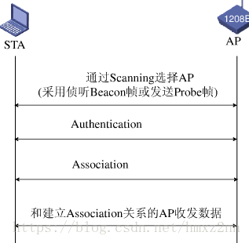
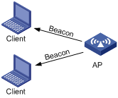
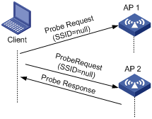
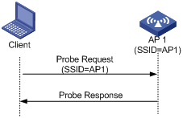
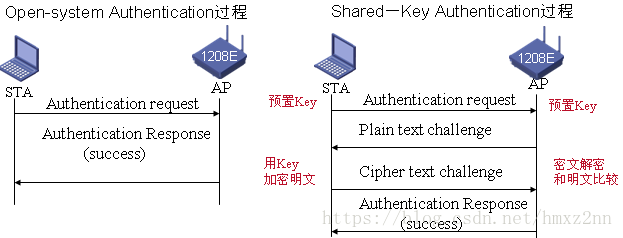
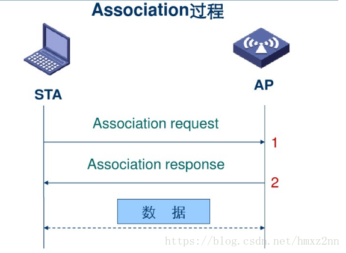

# 无线知识总结

---

## 常见无线协议

|   协议   | 工作（载波）频率 | 理论最高速率 | 关键点                                                       |
| :------: | :--------------: | :----------: | :----------------------------------------------------------- |
|  802.11  |       2.4G       |    2 Mbps    | 原始无线局域网通信标准                                       |
| 802.11a  |        5G        |   54 Mbps    | 相比于802.11b，覆盖范围较小，但是吞吐量有优势                |
| 802.11b  |       2.4G       |   11 Mbps    | 目前最流行的WLAN协议，实际使用速率和距离相关，成本也较低     |
| 802.11g  |       2.4G       |   54 Mbps    | 是802.11b在同频段的扩展，兼容802.11b                         |
| 802.11k  |                  |              | 阐述了无线局域网中频谱测量所能提供的服务，并以协议方式规定了测量的类型及接收发送的格式，快速识别周围可供漫游的AP |
| 802.11r  |                  |              | 使用“快速基本服务设置切换功能“（FT），可以更快地与AP关联     |
| 802.11v  |                  |              | 无线网络管理，主要针对与运营商，提供WIFI网络提供的服务       |
| 802.11n  |    2.4G & 5G     |   600 Mbps   | 支持双频，也兼容以往的802.11 a/b/g                           |
| 802.11ac |                  |    1Gbps     | 802.11n的继任者                                              |
| 802.11ax |                  |              | 以现行的IEEE 802.11ac做为基底的草案，以提供比现行的传输速率加快4倍为目标 |

---

## 无线关联过程

* 流程

  

  1. 扫描(Scan)

     * 被动扫描（Passive Scanning），无线客户端只是通过监听周围AP发送的信标帧（Beacon帧）获取无线网络信息

       被动扫描是指客户端通过侦听AP定期发送的Beacon帧发现周围的无线网络。提供无线网络服务的AP设备都会周期性发送Beacon帧，所以无线客户端可以定期在支持的信道列表监听信标帧获取周围的无线网络信息。当用户需要节省电量时，可以使用被动扫描。一般VoIP语音终端通常使用被动扫描方式。 

       

     * 一种为主动扫描（Active Scanning），无线客户端在扫描的时候，同时主动发送一个探测请求帧（Probe Request帧），通过收到探测响应帧（Probe Response）获取网络信号

       主动扫描又可以分为两种情况：

       + 客户端发送广播探测请求帧（SSID为空）

         客户端会定期地在其支持的信道列表中，发送广播探测请求帧（ProbeRequest帧）扫描无线网络。当AP收到探测请求帧后，会回应探测响应帧（Probe Response帧）通告可以提供的无线网络信息。无线客户端通过主动扫描，可以主动获知可使用的无线服务，之后无线客户端可以根据需要选择适当的无线网络接入。

         

       + 客户端发送单播帧（携带指定的SSID）

         当无线客户端配置希望连接无线网络或者已经成功连接到一个无线网络情况下，客户端也会定期发送单播探测请求帧（Probe Request帧）(该报文携带要配置或者已经连接的无线网络的SSID)，当能够提供指定SSID无线服务的AP接收到探测请求后回复探测响应。通过这种方法，无线客户端可以主动扫描指定的无线网络。

         

  2. 认证(Authentication)

     为了保证无线链路的安全，无线用户接入过程中AP需要完成对无线终端的认证，只有通过认证后才能进入后续的关联阶段。802.11链路定义了两种认证机制：开放系统认证(open-system authentication)和共享密钥认证(shared-key authentication）。

     + 开放系统认证

       开放系统认证是一种不对站点身份进行认证的认证方式。原理上用户站点向接入点发出认证请求，仅仅是一个请求，不含任何用户名、口令等信息，就可以获得认证。开放系统认证的主要功能是让站点互相感知对方的存在，以便进一步建立通信关系来建立关联。 
       因为是无验证，所以申请者发送authentication报文，认证者收到后，同样发送authentication报文，并在status code字段置0，表示认证成功。

       

     + 共享密钥认证

       共享密钥认证是指通过判决对方是否掌握相同的密钥来确定对方身份是否合法。密钥是网络上所有合法用户共有的，而不从属于单个用户，故称为“共享”密钥。密钥对应的加密方法是有线等效保密（Wired Equivalent Privacy,WEP)，用以防止非法用户窃听或侵入无线网络。

       共享密钥认证的过程只有四个步骤，在认证前，需要在STA和AP上都配置相同的密钥，否则是不能认证成功的。 

       1. 认证的第一步，是由STA向AP发送一个认证请求。 

       2. 接着，AP在收到请求后会生成一个挑战短语，再将这个挑战短语发送给STA，假设这个挑战短语是A。 
       3. 然后，STA会用自己的密钥Key将挑战短语进行加密，加密后再发给AP，假设加密后变为了B。 
       4. 最后，AP收到STA的加密后信息B，用自己的密钥Key进行解密。只要STA和AP上的密钥配置的一致，解密出来的结果就会是A，AP会将这个结果与最开始发给STA的挑战短语进行对比，发现结果一致，则告知STA认证成功，结果不一致则就会认证失败。

       由于已经WEP已经不再安全，所以共享密钥认证方式已经停用。

       

  3. 关联(Association)

     如果用户想接入无线网络，必须同特定的AP关联。当用户通过指定SSID选择无线网络，并通过AP链路认证后，就会立即向AP发送关联请求。AP会对关联请求帧携带的能力信息进行检测，最终确定该无线终端支持的能力，并回复关联响应通知链路是否关联成功。通常，无线终端同时只可以和一个AP建立链路，而且关联总是由无线终端发起。 

     

  *漫游*

  当STA移动时就涉及到漫游问题，如果是在同一组网下漫游就无需重新认证而只需要重新关联。

---

## 常见问题和解决思路

1. 无法关联WIFI 

   抓包，看上述流程是哪个帧出了异常

2. 关联WIFI后不能上网/ping不通

   看STA的报文在哪一步出了问题

---

## 常用工具和指令

+ iwpriv / iwconfig / iwlist

+ ominipeek

# 常见网络协议

| Protocol | Explaination | Application |
| -------- | ------------ | ----------- |
| TCP      |              |             |
| UDP      |              |             |
| HTTP     |              |             |
| HTTPS    |              |             |
| DHCP     |              |             |
| DNS      |              |             |
| ARP      |              |             |
| ICMP     |              |             |
| IGMP     |              |             |
| OSPF     |              |             |
|          |              |             |

